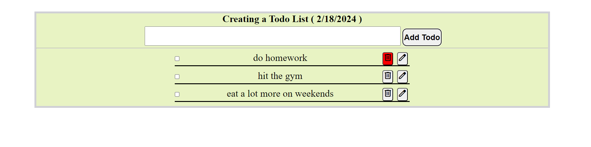
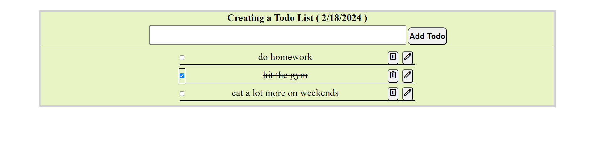

# React + Vite

## I. Introduce to the app main functionality

1. The app is created using the Vite@latest template for React. 
2. Its main functionality is to pass data from a child component `<UserInputForm />` to a parent component `<UserDashboard/>` via a callback. It also can be done either using class components or functional components
3. User stories: ADD, UPDATE & DELETE task(s), as well as MARK the task when it's done.

## II. Preview

## III. Visit the webpage here
[pp-portfolio page](https://hon-nova.github.io/todolist_2/)
